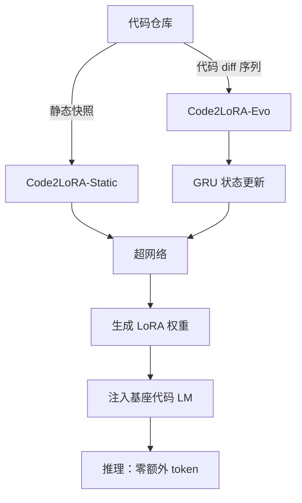

# HuggingFace Daily Papers Top 1 - 2026-06-06

## Code2LoRA: Hypernetwork-Generated Adapters for Code Language Models under Software Evolution

- **arXiv ID**: 2606.06492
- **作者**: Liliana Hotsko, Yinxi Li, Yuntian Deng, Pengyu Nie
- **提交者**: Liliana (@lilianahotsko)
- **Upvotes**: 43
- **HuggingFace 链接**: https://huggingface.co/papers/2606.06492
- **arXiv 链接**: https://arxiv.org/abs/2606.06492

---

## 论文解读

### 一、核心贡献与创新点

1. **提出 Code2LoRA 框架**：利用超网络（Hypernetwork）动态生成仓库级别的 LoRA 适配器，将仓库知识注入代码语言模型，**无需推理时额外的 token 开销**，解决了 RAG 长上下文和逐仓库微调的成本问题。

2. **双模式设计**：
   - **Code2LoRA-Static**：针对稳定代码库，将单一仓库快照转换为适配器
   - **Code2LoRA-Evo**：针对演化中的代码库，通过 GRU 隐状态逐 diff 更新适配器，适应持续开发场景

3. **构建 RepoPeftBench 基准**：包含 604 个 Python 仓库，提供静态轨道（40K 训练 / 12K 测试）和演化轨道（215K / 87K），填补了参数高效微调在仓库级评估上的空白。

### 二、技术方法分析

- **超网络架构**：输入仓库的表征（代码嵌入），输出 LoRA 的低秩矩阵 $A$ 和 $B$，使得适配器 $\Delta W = BA$ 编码仓库特定知识
- **演化机制**：Code2LoRA-Evo 用 GRU 维护隐状态 $h_t$，每次提交 diff 后更新 $h_{t+1} = \text{GRU}(h_t, \text{Enc}(\text{diff}_t))$，再由超网络从 $h_{t+1}$ 生成新适配器
- **训练策略**：在跨仓库数据上训练超网络，使其泛化到未见仓库；任务为断言补全（assertion completion）
- **核心优势**：相比逐仓库 LoRA 微调 $O(N)$ 次训练，Code2LoRA 只需一次超网络训练，推理时前向一次即可生成适配器

### 三、潜在影响与应用场景

| 维度 | 分析 |
|------|------|
| **开发效率** | 企业级多仓库场景下，无需逐仓库微调，大幅降低适配成本 |
| **持续集成** | Code2LoRA-Evo 可嵌入 CI/CD 流水线，每次提交自动更新模型适配 |
| **代码补全/测试生成** | 在 IDE 中提供仓库感知的智能补全，无需检索增强的长上下文 |
| **推理延迟** | 零 token 开销意味着不增加推理长度，对延迟敏感场景友好 |
| **局限性** | 目前仅验证断言补全任务，泛化到更多代码任务（如 bug 修复、代码审查）尚需验证 |

### 四、推荐理由

1. **问题定义精准**：抓住了"仓库级知识注入"与"软件演化"两个实际痛点，比静态 RAG 更优雅
2. **方法新颖且实用**：超网络 + GRU 演化设计简洁有效，Static 达到逐仓库 LoRA 的上界，Evo 超出共享 LoRA +5.2pp
3. **评估严谨**：自建大规模基准 RepoPeftBench，覆盖静态与演化双场景
4. **工程价值高**：零推理开销的仓库适配方案对工业界代码助手有直接参考意义

---

**一句话总结**：Code2LoRA 通过超网络将仓库知识"编译"为 LoRA 权重，以零推理开销实现仓库感知的代码生成，并首次用 GRU 状态追踪机制优雅地解决了软件演化下模型适配的难题。

---

## 摘要 (Abstract)

Code language models need repository-level context to resolve imports, APIs, and project conventions. Existing methods inject this knowledge as long inputs (retrieved through RAG or dependency analysis) or through per-repository fine-tuning and LoRA -- costly at repository scale and brittle to evolving codebases. We introduce Code2LoRA, a hypernetwork framework that generates repository-specific LoRA adapters, effectively injecting repository knowledge with zero inference-time token overhead. Code2LoRA supports two usage scenarios: Code2LoRA-Static converts a single repository snapshot into an adapter, suitable for comprehension of stable codebases; while Code2LoRA-Evo maintains an adapter backed by a GRU hidden state updated per code diff, suitable for active development of evolving codebases. To evaluate Code2LoRA against parameter-efficient fine-tuning baselines, we build RepoPeftBench, a benchmark of 604 Python repositories with two tracks: a static track with 40K training and 12K test assertion-completion tasks, and an evolution track with 215K commit-derived training and 87K commit-derived test tasks. On the static track, Code2LoRA-Static achieves 63.8% cross-repo and 66.2% in-repo exact match, matching the per-repository LoRA upper bound; on the evolution track, Code2LoRA-Evo achieves 60.3% cross-repo exact match (+5.2 pp over a single shared LoRA). Code2LoRA's code can be found at https://anonymous.4open.science/r/code2lora-6857; the model checkpoints and RepoPeftBench datasets can be found at https://huggingface.co/code2lora.

## AI 摘要

Code2LoRA is a hypernetwork framework that generates repository-specific LoRA adapters for code language models, supporting both static and evolving codebases with efficient parameter-efficient fine-tuning.

## 关键词

Code2LoRA, hypernetwork framework, LoRA adapters, repository-level context, parameter-efficient fine-tuning, GRU hidden state, code diffs, RepoPeftBench, assertion-completion tasks, cross-repo exact match, in-repo exact match
