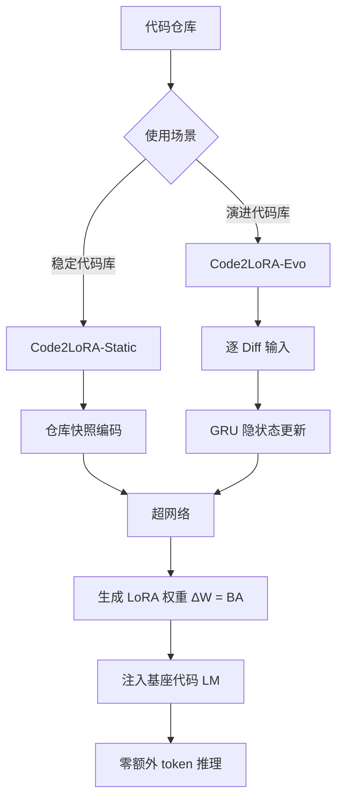

# HuggingFace Daily Papers Top 1 - 2026-06-08

## Code2LoRA: Hypernetwork-Generated Adapters for Code Language Models under Software Evolution

- **arXiv ID**: 2606.06492
- **作者**: Liliana Hotsko, Yinxi Li, Yuntian Deng, Pengyu Nie
- **提交者**: Liliana (@lilianahotsko)
- **Upvotes**: 72
- **HuggingFace 链接**: https://huggingface.co/papers/2606.06492
- **arXiv 链接**: https://arxiv.org/abs/2606.06492

---

## 论文解读

### 一、核心贡献与创新点

1. **提出 Code2LoRA 框架**：通过超网络（Hypernetwork）动态生成仓库级别的 LoRA 适配器，无需在推理时注入额外的上下文 token，实现了**零推理开销**的仓库知识注入。

2. **双模式设计**：
   - **Code2LoRA-Static**：将仓库快照编码为适配器，适用于稳定代码库的理解任务
   - **Code2LoRA-Evo**：通过 GRU 隐状态逐 diff 更新适配器，适用于持续演进的代码库

3. **构建 RepoPeftBench 基准**：包含 604 个 Python 仓库，提供静态轨道（40K 训练 / 12K 测试）和演化轨道（215K / 87K），填补了仓库级参数高效微调评估的空白。

4. **性能匹配上界**：Static 模式达到 per-repo LoRA 微调的性能上界（63.8% / 66.2%），Evo 模式超越共享 LoRA 基线 +5.2pp。

### 二、技术方法分析

**核心技术路线**：

- **超网络架构**：输入仓库表示，输出 LoRA 的低秩矩阵 $\Delta W = BA$，将仓库知识"压缩"进适配器参数中
- **Static 模式**：对仓库代码做一次性编码（可能使用代码嵌入或结构化特征提取），生成固定适配器
- **Evo 模式**：维护隐状态 $h_t$，每次 commit diff 后更新：$h_t = \text{GRU}(h_{t-1}, \text{Enc}(\text{diff}_t))$，再由超网络将 $h_t$ 映射为 LoRA 参数
- **对比优势**：相比 RAG 需要长上下文窗口，相比 per-repo LoRA 需要逐仓库训练，Code2LoRA 实现了**一次训练、跨仓库泛化**

### 三、潜在影响与应用场景

| 维度 | 分析 |
|------|------|
| **IDE 代码补全** | 零 token 开销意味着不占用上下文窗口，可与现有补全管线无缝集成 |
| **企业私有代码库** | 每个团队/仓库自动获得定制适配器，无需昂贵的独立微调 |
| **CI/CD 集成** | Evo 模式可随 commit 自动更新适配器，保持模型与代码同步 |
| **降低成本** | 避免了 per-repo 微调的 GPU 开销和 RAG 的长上下文推理成本 |
| **研究方向** | 超网络生成适配器的范式可推广到其他领域特定任务 |

**局限性**：目前仅在 Python 和 assertion-completion 任务上验证，泛化到其他语言和任务类型（如代码生成、bug 修复）有待探索。

### 四、推荐理由

1. **问题定义精准**：直击代码 LM 在仓库级上下文建模中的核心痛点——长上下文成本与微调不可扩展性
2. **方法设计优雅**：超网络 + GRU 的组合巧妙地将"仓库知识适配"转化为"参数生成"问题，零推理开销是实用性的关键
3. **实验充分**：自建大规模 benchmark（RepoPeftBench），与合理的 baselines 对比，结果令人信服
4. **工程价值高**：在 VS Code 等 IDE 场景中，可直接作为代码智能后端的适配层，具有明确的落地路径
5. **开放性好**：代码、模型和数据集均开源

---

**一句话总结**：Code2LoRA 通过超网络将仓库知识压缩为动态生成的 LoRA 适配器，以零推理开销实现了可扩展、可演进的仓库级代码理解，是代码智能从"通用模型"走向"仓库感知"的优雅方案。

---

## 摘要 (Abstract)

Code language models need repository-level context to resolve imports, APIs, and project conventions. Existing methods inject this knowledge as long inputs (retrieved through RAG or dependency analysis) or through per-repository fine-tuning and LoRA -- costly at repository scale and brittle to evolving codebases. We introduce Code2LoRA, a hypernetwork framework that generates repository-specific LoRA adapters, effectively injecting repository knowledge with zero inference-time token overhead. Code2LoRA supports two usage scenarios: Code2LoRA-Static converts a single repository snapshot into an adapter, suitable for comprehension of stable codebases; while Code2LoRA-Evo maintains an adapter backed by a GRU hidden state updated per code diff, suitable for active development of evolving codebases. To evaluate Code2LoRA against parameter-efficient fine-tuning baselines, we build RepoPeftBench, a benchmark of 604 Python repositories with two tracks: a static track with 40K training and 12K test assertion-completion tasks, and an evolution track with 215K commit-derived training and 87K commit-derived test tasks. On the static track, Code2LoRA-Static achieves 63.8% cross-repo and 66.2% in-repo exact match, matching the per-repository LoRA upper bound; on the evolution track, Code2LoRA-Evo achieves 60.3% cross-repo exact match (+5.2 pp over a single shared LoRA). Code2LoRA's code can be found at https://anonymous.4open.science/r/code2lora-6857; the model checkpoints and RepoPeftBench datasets can be found at https://huggingface.co/code2lora.

## AI 摘要

Code2LoRA is a hypernetwork framework that generates repository-specific LoRA adapters for code language models, supporting both static and evolving codebases with efficient parameter-efficient fine-tuning.

## 关键词

Code2LoRA, hypernetwork framework, LoRA adapters, repository-level context, parameter-efficient fine-tuning, GRU hidden state, code diffs, RepoPeftBench, assertion-completion tasks, cross-repo exact match, in-repo exact match
