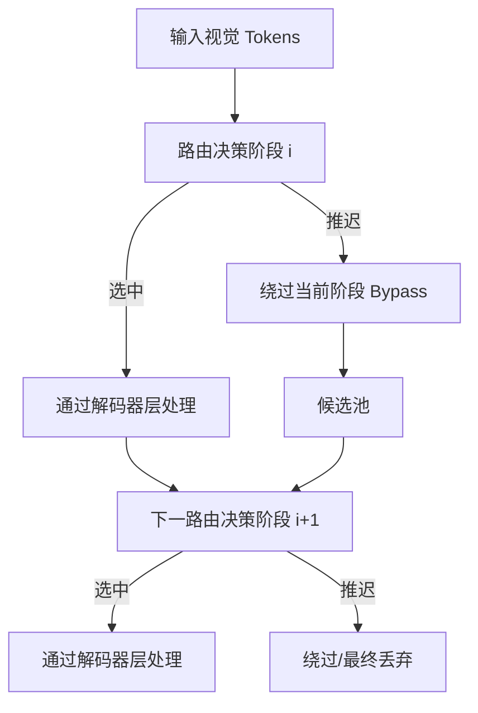

# HuggingFace Daily Papers Top 1 - 2026-06-12

## Reroute, Don't Remove: Recoverable Visual Token Routing for Vision-Language Models

- **arXiv ID**: 2606.12412
- **作者**: Cheng-Yu Yang, Shao-Yuan Lo, Yu-Lun Liu
- **提交者**: Yu-Lun Liu (@yulunliu)
- **Upvotes**: 14
- **HuggingFace 链接**: https://huggingface.co/papers/2606.12412
- **arXiv 链接**: https://arxiv.org/abs/2606.12412

---

## 论文解读

### 一、核心贡献与创新点

1. **提出关键洞察**：视觉 token 的重要性随解码器深度动态变化——在某一层被判定为"不重要"的 token，可能在后续层变得关键，尤其在需要空间定位（grounding）的任务中。

2. **范式转换**：将现有的"排序-删除"（rank-and-remove）不可逆范式，转变为**可恢复路由**（recoverable routing）范式。被推迟处理的 token 不是被永久丢弃，而是绕过当前阶段后重新进入候选池。

3. **即插即用、无需训练**：Reroute 是一个 training-free 的插件，可直接复用现有方法（FastV、PDrop、Nüwa）的评分规则和调度策略，无需额外微调。

4. **保持计算预算不变**：在理论 TFLOPs 和 KV-cache 预算类别上与原始剪枝方法一致，不引入额外计算开销。

---

### 二、技术方法分析

**核心机制**：

- **路由而非删除**：在每个路由阶段，利用注意力分数对视觉 token 排序，高分 token 正常通过解码器 block，低分 token 不被丢弃而是 bypass 当前阶段。
- **延迟再入**：被 bypass 的 token 在下一个路由决策点重新加入候选池，有机会在后续阶段被选中处理。
- **复用现有基础设施**：直接沿用 FastV/PDrop/Nüwa 等方法的 attention-score ranking 规则和分阶段调度（stage-wise schedule），仅改变"丢弃"动作为"延迟"。
- **计算等价性**：每个阶段实际参与注意力计算的 token 数量与原方法相同，因此 FLOPs 和 KV-cache 占用保持在同一量级。

---

### 三、潜在影响与应用场景

| 维度 | 分析 |
|------|------|
| **学术影响** | 为视觉 token 压缩领域提供了新思路——从"信息不可逆丢失"走向"信息可恢复调度"，可能启发更多动态路由研究 |
| **工程价值** | 即插即用特性使其可快速集成到现有 VLM 部署流水线中，降低落地门槛 |
| **适用场景** | 视觉定位/Grounding 任务、高分辨率图像理解、边缘设备上的 VLM 推理加速 |
| **局限性** | 需要维护候选池的额外逻辑；在极端压缩率下 bypass 池可能仍不够；对非 grounding 类一般 VQA 提升可能有限 |

---

### 四、推荐理由

1. **问题定义精准**：准确指出了"token 重要性随层变化"这一被忽视的现象，动机清晰且有说服力。
2. **方法优雅简洁**：不引入新参数、不需训练，仅通过路由策略调整即获得显著改进，体现了"简单有效"的研究品味。
3. **兼容性强**：作为通用插件兼容多种主流剪枝方法和多种 backbone（LLaVA-1.5、Qwen），实用性高。
4. **视角新颖**：将 token 减少问题重新定义为**调度/路由问题**，为后续研究打开了新的设计空间。

---

> **一句话总结**：Reroute 通过将视觉 token 的"不可逆删除"转变为"可恢复路由"，以零训练成本在保持计算预算的同时显著改善了 VLM 在激进 token 压缩下的空间定位能力，是一个简洁而实用的即插即用方案。

---

## 摘要 (Abstract)

Vision-language models (VLMs) project images into hundreds to thousands of visual tokens, making decoder inference expensive in both attention computation and KV-cache memory. Existing visual-token reduction methods largely follow a rank-and-remove paradigm: they score visual tokens, keep a compact subset, and permanently discard the rest. We show that this irreversible action is fragile because visual-token importance changes across decoder depth; tokens ranked low at one stage may become relevant in later layers, especially for grounding-sensitive queries. We propose Reroute, a training-free plug-in that replaces removal with recoverable routing. At each routing stage, selected vision tokens pass through decoder blocks, while deferred tokens bypass the stage and re-enter the candidate pool at the next routing decision. Reroute reuses existing attention-score ranking rules and stage-wise schedules, preserving the theoretical TFLOPs and KV-cache budget class of the pruning method it augments. Across FastV, PDrop, and Nüwa variants on LLaVA-1.5 and Qwen backbones, reroute improves grounding under aggressive token reduction while maintaining general VQA performance. These results suggest that VLM token reduction should not be viewed only as irreversible pruning, but also as recoverable routing. The code can be found here: https://github.com/elmma/mllm-reroute/

## AI 摘要

Vision-language models can improve grounding performance under aggressive token reduction by replacing irreversible visual-token pruning with recoverable routing that allows tokens to re-enter the processing pipeline at later stages.

## 关键词

vision-language models, visual tokens, decoder inference, attention computation, KV-cache memory, rank-and-remove paradigm, visual-token reduction, decoder blocks, routing stages, attention-score ranking, token reduction, grounding-sensitive queries
