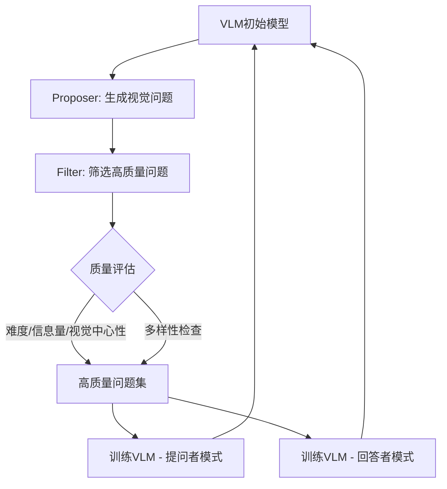

# HuggingFace Daily Papers Top 1 - 2026-06-18

## Self-Evolving Visual Questioner

- **arXiv ID**: 2606.13929
- **作者**: Yijun Liang, Hengguang Zhou, Ming Li, Lichen Li, Cho-Jui Hsieh, Tianyi Zhou
- **提交者**: Joanna Liang (@joliang17)
- **Upvotes**: 11
- **HuggingFace 链接**: https://huggingface.co/papers/2606.13929
- **arXiv 链接**: https://arxiv.org/abs/2606.13929

---

## 论文解读

### 一、核心贡献与创新点

1. **提出自进化视觉提问框架**：首次证明VLM可以在**无需外部监督**的情况下，持续提升自身作为"视觉提问者"的能力，打破了传统依赖高质量标注数据的瓶颈。

2. **双重角色自我迭代**：VLM同时扮演**提议者（proposer）**和**过滤器（filter）**两个角色，自主生成更难、更具信息量、更以视觉为中心的问题，并筛选高质量样本用于训练。

3. **探索多样性维持机制**：设计了避免训练坍塌（training collapse）的多样性保持策略，确保生成的问题在难度提升的同时不会退化为同质化输出。

4. **新型评估协议**：引入了基于Agent的评估协议，从**感知（perception）、推理（reasoning）、多样性（diversity）**三个维度系统评估提问质量。

5. **提问与回答的双重增益**：自进化的提问者不仅生成更好的问题，还能保持甚至提升其作为回答者的能力。

### 二、技术方法分析

- **自监督闭环**：模型生成问题 → 自我筛选 → 自我训练 → 生成更好的问题，形成正向迭代循环
- **质量过滤维度**：确保问题是非平凡的（non-trivial）、视觉锚定的（grounded）、且难度递增
- **双模式训练**：同一批自生成数据同时用于提问和回答两种能力的训练，实现资源高效利用
- **对比优势**：在相同训练预算下，自监督方式优于使用静态源数据的传统训练

### 三、潜在影响与应用场景

| 领域 | 应用方式 |
|------|----------|
| **教育** | 自动生成高质量视觉教学问题，辅助教师出题 |
| **主动学习** | 模型主动提问以获取最有价值的标注，降低标注成本 |
| **人机交互** | VLM主动发问以澄清用户意图，提升对话质量 |
| **数据飞轮** | 自动扩充高质量VQA训练数据，减少人工标注依赖 |
| **模型评估** | 自动生成测试基准，评估其他VLM的视觉理解能力 |

**潜在影响**：挑战了"模型只能被动回答"的范式，为VLM的自主进化和主动学习开辟了新方向，对降低数据标注成本和实现模型自我改进具有重要意义。

### 四、推荐理由

1. **范式创新**：从"被动回答者"到"主动提问者"的转变，是VLM能力边界的有意义扩展
2. **实用性强**：无需外部标注的自进化机制，极大降低了实际部署门槛
3. **方法通用**：适用于多种backbone VLM，具有良好的可迁移性
4. **双赢结果**：提问能力提升的同时回答能力不降反升，证明了方法的稳健性
5. **评估完备**：提出的agentic评估协议填补了视觉提问领域的评估空白

---

**一句话总结**：这篇论文提出了一种让VLM通过自我进化成为优秀"视觉提问者"的无监督框架，在无需外部数据的前提下同时提升了模型的提问与回答能力，为VLM的主动学习和自主演化提供了新范式。

---

## 摘要 (Abstract)

Vision-language models (VLMs) are typically trained as passive answerers, while their ability to actively ask diverse, non-trivial, visual-centric and grounded questions remains underexplored. Existing visual questioners' performance is bottlenecked by the availability of high-quality training data or the cost of curating them. We show that a VLM can continuously improve itself as a visual questioner without any external supervision. We propose a self-evolving framework that uses a VLM itself as both a proposer and a filter to produce harder, more informative, and visual-centric questions, while maintaining their exploration diversity to avoid training collapse. These questions are then used to train the VLM in both questioner and answerer modes. To evaluate the questioner, we introduce an agentic protocol that assesses questions along perception, reasoning, and diversity dimensions. Experiments across various backbone VLMs show that our method substantially enhances the quality and substantially expands the difficulty boundary of autonomous question generation. Under the same budget, our self-supervision is more effective than training on the static source data. Moreover, the self-evolving questioner remains a competitive or even better answerer.

## AI 摘要

A vision-language model autonomously improves its question-generation capabilities through self-evolution, enhancing both question quality and answerer performance without external supervision.

## 关键词

vision-language models, visual questioner, self-evolving framework, visual-centric questions, training data, question generation, answerer mode, questioner mode, agentic protocol, training collapse
