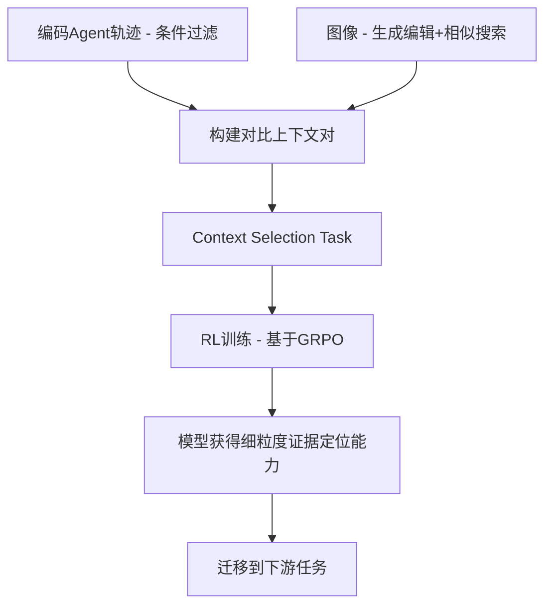

# HuggingFace Daily Papers Top 1 - 2026-06-21

## Context-Aware RL for Agentic and Multimodal LLMs

- **arXiv ID**: 2606.17053
- **作者**: Peiyang Xu, Bangzheng Li, Sijia Liu, Karthik R. Narasimhan, Pramod Viswanath, Prateek Mittal, Xingyu Fu
- **提交者**: py xu (@xupy21)
- **Upvotes**: 9
- **HuggingFace 链接**: https://huggingface.co/papers/2606.17053
- **arXiv 链接**: https://arxiv.org/abs/2606.17053

---

## 论文解读

### 一、核心贡献与创新点

1. **提出 ContextRL 框架**：一种上下文感知的强化学习方法，通过**间接辅助目标**（indirect auxiliary objective）提升 LLM 在长上下文和多模态场景中的细粒度推理能力。

2. **创新的训练范式**：不同于传统仅监督最终答案的方式，ContextRL 让模型在两个高度相似的上下文中**选择支持 query-answer 对的正确上下文**，从而迫使模型学会细粒度的证据定位（fine-grained grounding）。

3. **对比性上下文数据构建**：
   - 编码智能体领域：利用轨迹（trajectories）作为上下文，通过条件过滤构建 1K 对比对
   - 多模态推理领域：利用图像作为上下文，通过生成式编辑和相似性搜索构建 7K 对比对

4. **实验证明增益来源于目标设计**：通过与数据增强基线对比，证明性能提升源于上下文选择目标本身，而非额外数据。

### 二、技术方法分析

**核心思想**：

$$\text{Reward} = \mathbb{1}[\text{model selects context that supports } (q, a)]$$

模型接收三元组 $(query, answer, \{context_1, context_2\})$，需判断哪个上下文支撑了给定的 query-answer 对。

**技术流程**：

**关键设计选择**：

- **间接目标**：不直接训练答题能力，而是训练"找证据"的能力，属于能力的间接强化
- **对比学习思想**：两个上下文高度相似，仅在关键细节上不同，逼迫模型关注微小但决定性的信息
- **基于 GRPO 的 RL 优化**：利用标准的群组相对策略优化进行训练

**实验结果**：
- 长上下文推理：5 个 benchmark 平均 **+2.2%**
- 视觉问答：12 个 benchmark 平均 **+1.8%**

### 三、潜在影响与应用场景

**潜在影响**：
- 为 RL 训练 LLM 提供了新的**辅助目标设计思路**——通过训练"元能力"间接提升下游表现
- 挑战了"更多数据=更好性能"的简单假设，强调**训练目标设计**的重要性
- 为解决 LLM "大海捞针"（needle-in-a-haystack）问题提供了系统性方案

**应用场景**：
| 场景 | 应用方式 |
|------|----------|
| 编码 Agent | 在长工具调用轨迹中定位关键错误 |
| 医学影像 | 在相似图像中识别细微病变差异 |
| 法律文档分析 | 在冗长合同中定位关键条款 |
| 多模态 RAG | 提升检索证据与答案的对齐质量 |

### 四、推荐理由

1. **思路新颖**：用"选上下文"作为 RL 奖励信号的间接训练方式，简洁而有效
2. **实验严谨**：通过数据增强基线消融，清晰归因性能增益来源
3. **通用性强**：方法可扩展到任何需要细粒度证据定位的场景
4. **实用性高**：数据构建成本可控（1K-7K 对），易于复现和应用

---

**一句话总结**：ContextRL 通过"让模型学会找证据"这一间接 RL 目标，以极低的数据成本有效提升了 LLM 在长上下文和多模态场景中的细粒度推理能力，是一种优雅且实用的训练范式创新。

---

## 摘要 (Abstract)

Large language models (LLMs) often fail when answering requires identifying a small but decisive piece of evidence within a long or complex context, such as a single line in a tool trace or a subtle detail in an image. We propose ContextRL, a context-aware reinforcement learning (RL) method that improves long-horizon reasoning and multimodal performance through an \emph{indirect} auxiliary objective. Instead of supervising only the final answer, ContextRL presents the model with a query, an answer, and two highly similar contexts, and rewards it for selecting the context that supports the query--answer pair, thereby encouraging fine-grained grounding. We construct contrastive context data in two domains: for coding agents, trajectories serve as contexts, yielding 1k pairs built via condition filtering; for multimodal reasoning, images serve as contexts, yielding 7K pairs built via generative editing and similarity search. ContextRL achieves average gains of +2.2% over standard GRPO on 5 long-horizon benchmarks, and +1.8% across 12 diverse visual question answering benchmarks. To disentangle the effect of the proposed objective from that of additional data, we compare against data-augmentation baselines that repurpose the same contrastive contexts as standard query--context--answer examples. These baselines provide little to no improvement, showing that the gains arise from the proposed context-selection objective rather than from the contrastive data alone.

## AI 摘要

ContextRL enhances long-horizon reasoning and multimodal performance through reinforcement learning that rewards context selection for supporting query-answer pairs, achieving improvements over standard methods on diverse benchmarks.

## 关键词

reinforcement learning, indirect auxiliary objective, fine-grained grounding, contrastive context data, long-horizon reasoning, multimodal reasoning, visual question answering, data augmentation baselines
