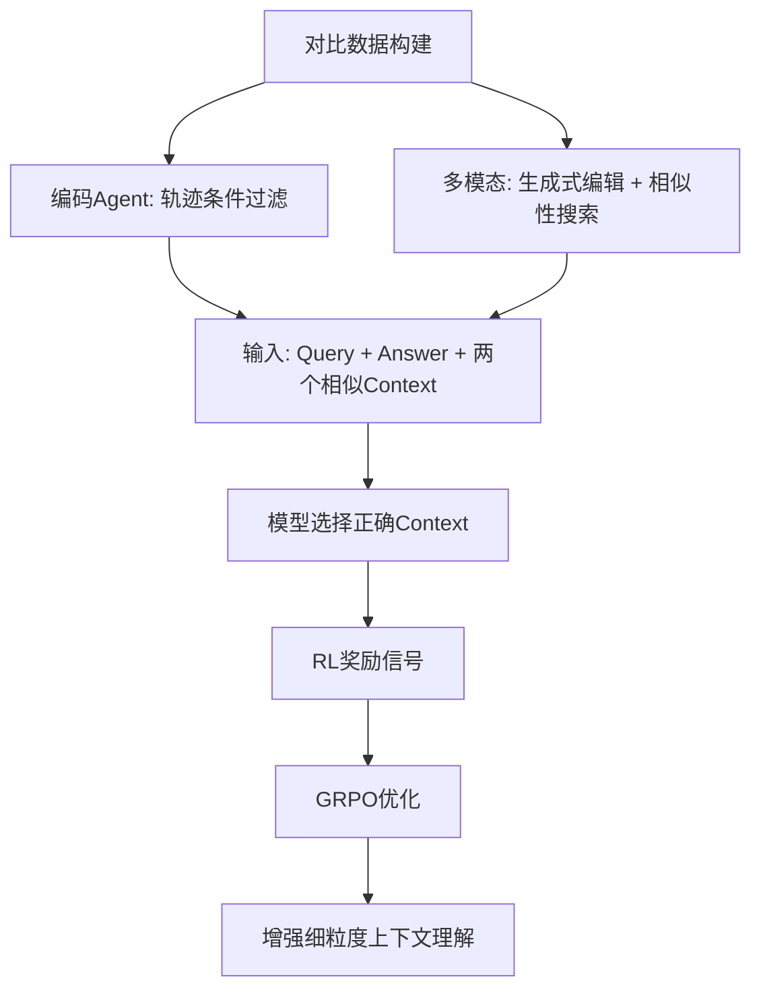

# HuggingFace Daily Papers Top 1 - 2026-06-22

## Context-Aware RL for Agentic and Multimodal LLMs

- **arXiv ID**: 2606.17053
- **作者**: Peiyang Xu, Bangzheng Li, Sijia Liu, Karthik R. Narasimhan, Pramod Viswanath, Prateek Mittal, Xingyu Fu
- **提交者**: py xu (@xupy21)
- **Upvotes**: 10
- **HuggingFace 链接**: https://huggingface.co/papers/2606.17053
- **arXiv 链接**: https://arxiv.org/abs/2606.17053

---

## 论文解读

### 一、核心贡献与创新点

1. **提出 ContextRL 框架**：一种上下文感知的强化学习方法，通过**间接辅助目标**（indirect auxiliary objective）提升 LLM 在长上下文和多模态场景中的细粒度推理能力。

2. **创新的训练范式**：不同于传统只监督最终答案的方式，ContextRL 让模型在两个高度相似的上下文中选择支持给定 query-answer 对的那个，从而迫使模型学会**细粒度的上下文锚定（grounding）**。

3. **对比性上下文数据构建方法**：
   - 编码智能体领域：利用轨迹作为上下文，通过条件过滤构建 1K 对比对
   - 多模态推理领域：利用图像作为上下文，通过生成式编辑和相似性搜索构建 7K 对比对

4. **严格的消融验证**：通过数据增强基线对比，证明提升来自**上下文选择目标本身**，而非额外对比数据带来的信息增益。

### 二、技术方法分析

**核心技术要点：**

- **间接监督信号设计**：将"找到关键证据"这一隐式能力，转化为"在对比上下文中做选择"这一显式可优化目标
- **基于 GRPO 的强化学习**：在标准 GRPO 基础上增加上下文选择奖励
- **对比对构建策略**：确保两个上下文高度相似（仅在关键细节上不同），迫使模型关注微妙差异
- **跨域通用性**：同一框架适用于文本轨迹（Agent 场景）和视觉输入（多模态场景）

**效果数据：**
- 长上下文推理：5 个基准上平均 **+2.2%**（对比标准 GRPO）
- 视觉问答：12 个基准上平均 **+1.8%**

### 三、潜在影响与应用场景

| 维度 | 说明 |
|------|------|
| **Agent 系统** | 提升 coding agent 对长工具调用轨迹中关键错误信息的定位能力 |
| **多模态理解** | 增强模型对图像细微差异的感知（如医学影像细节识别） |
| **RAG 系统** | 改善检索增强生成中对证据片段的精准利用 |
| **长文档 QA** | 在法律、金融等需要精确定位证据的场景中提升可靠性 |
| **训练范式启发** | "间接目标提升直接能力"的思路可推广到其他能力训练 |

**潜在局限**：绝对提升幅度相对有限（1.8%~2.2%），对比数据构建需要领域定制化工程。

### 四、推荐理由

1. **问题定位精准**：LLM 在长上下文中"找不到关键证据"是当前公认的瓶颈问题
2. **方法设计优雅**：用间接辅助目标绕开直接监督的困难，思路简洁且有理论美感
3. **实验设计严谨**：通过数据增强基线消融，排除了"数据量增加"这一混淆因素
4. **通用性强**：框架跨文本和视觉两个模态均有效，可扩展性好
5. **实用门槛低**：1K~7K 级别的对比数据量，工程落地成本可控

---

**一句话总结**：ContextRL 通过"让模型在对比上下文中做选择"这一巧妙的间接 RL 目标，有效提升了 LLM 在长上下文和多模态场景中定位关键证据的能力，为解决 LLM 细粒度推理不足提供了一条轻量且通用的路径。

---

## 摘要 (Abstract)

Large language models (LLMs) often fail when answering requires identifying a small but decisive piece of evidence within a long or complex context, such as a single line in a tool trace or a subtle detail in an image. We propose ContextRL, a context-aware reinforcement learning (RL) method that improves long-horizon reasoning and multimodal performance through an \emph{indirect} auxiliary objective. Instead of supervising only the final answer, ContextRL presents the model with a query, an answer, and two highly similar contexts, and rewards it for selecting the context that supports the query--answer pair, thereby encouraging fine-grained grounding. We construct contrastive context data in two domains: for coding agents, trajectories serve as contexts, yielding 1k pairs built via condition filtering; for multimodal reasoning, images serve as contexts, yielding 7K pairs built via generative editing and similarity search. ContextRL achieves average gains of +2.2% over standard GRPO on 5 long-horizon benchmarks, and +1.8% across 12 diverse visual question answering benchmarks. To disentangle the effect of the proposed objective from that of additional data, we compare against data-augmentation baselines that repurpose the same contrastive contexts as standard query--context--answer examples. These baselines provide little to no improvement, showing that the gains arise from the proposed context-selection objective rather than from the contrastive data alone.

## AI 摘要

ContextRL enhances long-horizon reasoning and multimodal performance through reinforcement learning that rewards context selection for supporting query-answer pairs, achieving improvements over standard methods on diverse benchmarks.

## 关键词

reinforcement learning, indirect auxiliary objective, fine-grained grounding, contrastive context data, long-horizon reasoning, multimodal reasoning, visual question answering, data augmentation baselines
