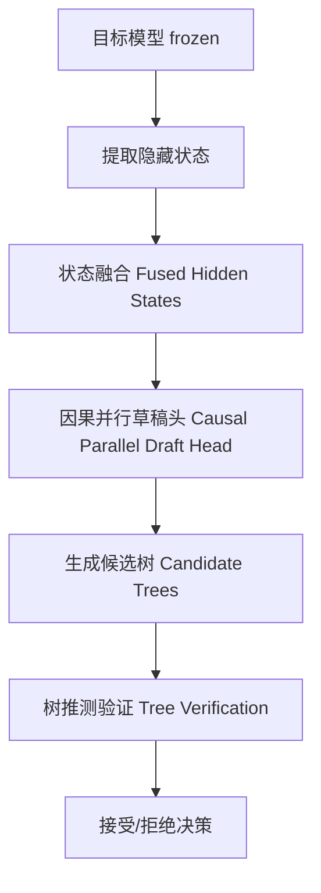

# HuggingFace Daily Papers Top 1 - 2026-06-27

## JetSpec: Breaking the Scaling Ceiling of Speculative Decoding with Parallel Tree Drafting

- **arXiv ID**: 2606.18394
- **作者**: Lanxiang Hu, Zhaoxiang Feng, Yulun Wu, Haoran Yuan, Yujie Zhao, Yu-Yang Qian, Bojun Wang, Peng Zhao, Daxin Jiang, Yibo Zhu, Tajana Rosing, Hao Zhang
- **提交者**: Lanxiang Hu (@Snyhlxde)
- **Upvotes**: 22
- **HuggingFace 链接**: https://huggingface.co/papers/2606.18394
- **arXiv 链接**: https://arxiv.org/abs/2606.18394

---

## 论文解读

### 一、核心贡献与创新点

JetSpec 提出了一种新的推测解码（Speculative Decoding）框架，核心贡献在于**打破了推测解码的扩展瓶颈**——即增加草稿预算（draft budget）时，速度提升遭遇天花板的问题。

**主要创新点：**

- **识别并解决了"因果性-效率困境"（Causality-Efficiency Dilemma）**：
  - 自回归草稿器：路径条件候选质量高，但开销随树深度线性增长
  - 双向块扩散草稿器：一次前向生成所有位置，但分支无关的边际分布导致树节点间不一致，浪费预算
- **提出因果并行草稿头（Causal Parallel Draft Head）**：在冻结的目标模型的融合隐藏状态上训练，实现**单次前向推理的效率**与**分支级因果条件**的结合
- **候选树评分与目标模型的自回归分解对齐**，使更大的草稿预算能有效转化为更长的接受前缀

### 二、技术方法分析

**关键技术细节：**

1. **融合隐藏状态**：从冻结的目标模型中提取多层隐藏状态进行融合，为草稿头提供丰富的上下文信息
2. **因果并行草稿头**：
   - 保持因果注意力掩码，确保每个候选 token 条件于其树路径上的祖先节点
   - 仅需一次前向传播即可生成整棵候选树，避免逐层自回归的开销
3. **与自回归分解对齐的训练目标**：草稿头的输出分布直接拟合目标模型的条件概率 $P(x_t | x_{<t})$，使验证阶段的接受率最大化
4. **支持 vLLM 集成**：在实际服务负载下验证了延迟优化效果

### 三、潜在影响与应用场景

**潜在影响：**

- **推理效率跃升**：在 MATH-500 上实现高达 $9.64\times$ 加速，对话场景 $4.58\times$，显著超越现有基线
- **扩展性突破**：解除了推测解码的扩展天花板，使"增加草稿预算→持续提速"成为可能
- **通用性强**：在 Dense 和 MoE（Qwen3）模型上均有效，覆盖数学、代码、对话多类任务

**应用场景：**

| 场景 | 价值 |
|------|------|
| LLM 在线服务 | 降低延迟、提升吞吐 |
| 代码生成 | 长序列生成加速 |
| 数学推理 | 高接受率场景收益最大 |
| 端侧/成本敏感部署 | 减少计算资源需求 |

### 四、推荐理由

1. **问题定义精准**：清晰揭示了现有方法的"因果性-效率困境"，为领域提供了新的分析框架
2. **方法设计优雅**：单次前向 + 因果条件的组合简洁有效，易于工程落地
3. **实验全面扎实**：覆盖多模型架构、多任务类型、多硬件场景，且已集成 vLLM
4. **开源可复现**：代码和模型均已公开，有利于社区跟进
5. **实用价值高**：直接面向 LLM 推理加速这一核心工程瓶颈

---

**一句话总结：** JetSpec 通过因果并行草稿头巧妙地统一了推测解码中效率与质量的矛盾，打破了草稿预算的扩展天花板，是当前 LLM 推理加速领域兼具理论洞察与工程实用性的重要工作。

---

## 摘要 (Abstract)

Speculative decoding (SD) accelerates autoregressive Large Language Models (LLMs) by drafting multiple tokens and verifying them in parallel, but it faces a scaling limitation: increasing the draft budget improves speed only when acceptance remains high and drafting overhead stays low. This ceiling has been difficult to break because prior head-based SD methods face a causality-efficiency dilemma. Autoregressive drafters produce path-conditioned candidates that are effective for tree speculative decoding with higher acceptance length, but their drafting cost grows with tree depth. Bidirectional block-diffusion drafters generate all positions in one pass, but their branch-agnostic marginals can form individually plausible yet mutually inconsistent trees, wasting budget and reducing acceptance. We propose JetSpec, a head-based SD framework that combines one-forward drafting efficiency with branch-wise causal conditioning. JetSpec trains a causal parallel draft head over fused hidden states from the frozen target model, producing candidate trees whose scores align with the target model's autoregressive factorization. This enables JetSpec to convert larger draft budgets into longer accepted prefixes and higher end-to-end speedup. Across math, coding, and chat benchmarks on dense and MoE Qwen3 models, JetSpec consistently outperforms bidirectional-head and tree-based SD baselines. On H100 GPUs, JetSpec achieves up to 9.64x speedup on MATH-500 and 4.58x on open-ended conversational workloads, with further latency gains demonstrated through vLLM integration under realistic serving loads. Our code and models are available at https://github.com/hao-ai-lab/JetSpec.

## AI 摘要

JetSpec is a speculative decoding framework that combines efficient forward drafting with causal conditioning to improve LLM inference speed and acceptance rates across various benchmarks.

## 关键词

speculative decoding, autoregressive Large Language Models, draft budget, acceptance rate, causality-efficiency dilemma, tree speculative decoding, bidirectional block-diffusion, branch-agnostic marginals, causal parallel draft head, fused hidden states, autoregressive factorization, end-to-end speedup, MoE Qwen3, vLLM integration
