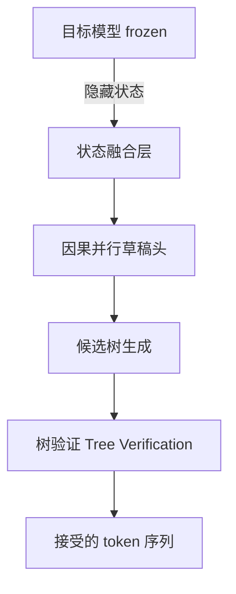

# HuggingFace Daily Papers Top 1 - 2026-06-28

## JetSpec: Breaking the Scaling Ceiling of Speculative Decoding with Parallel Tree Drafting

- **arXiv ID**: 2606.18394
- **作者**: Lanxiang Hu, Zhaoxiang Feng, Yulun Wu, Haoran Yuan, Yujie Zhao, Yu-Yang Qian, Bojun Wang, Peng Zhao, Daxin Jiang, Yibo Zhu, Tajana Rosing, Hao Zhang
- **提交者**: Lanxiang Hu (@Snyhlxde)
- **Upvotes**: 29
- **HuggingFace 链接**: https://huggingface.co/papers/2606.18394
- **arXiv 链接**: https://arxiv.org/abs/2606.18394

---

## 论文解读

### 一、核心贡献与创新点

JetSpec 的核心贡献在于**打破了推测解码（Speculative Decoding）的扩展性瓶颈**，即增加草稿预算（draft budget）后加速效果趋于饱和的问题。

主要创新点：

- **揭示了因果性-效率困境（Causality-Efficiency Dilemma）**：现有方法要么是自回归草稿器（因果准确但开销随树深增长），要么是双向块扩散草稿器（一次前向高效但分支间不一致），两者无法兼得。
- **提出因果并行草稿头（Causal Parallel Draft Head）**：在单次前向推理中生成候选树，同时保持分支级别的因果条件依赖，兼顾效率与质量。
- **融合隐藏状态设计**：利用冻结目标模型的隐藏状态进行融合，使草稿头的评分与目标模型的自回归分解对齐。
- **实现了显著的端到端加速**：在 MATH-500 上达到 **9.64x** 加速，在开放对话任务上达到 **4.58x** 加速。

### 二、技术方法分析

JetSpec 的技术架构可概括为：

**关键技术细节：**

1. **一次前向生成（One-Forward Drafting）**：与自回归草稿器不同，JetSpec 在单次前向传播中生成整棵候选树，避免了逐层递归的延迟累积。

2. **分支级因果条件（Branch-wise Causal Conditioning）**：不同于双向方法生成边际独立的 token（导致分支间不一致），JetSpec 的草稿头在生成候选时保留了树结构中的因果依赖关系，使得：
   $$P_{\text{draft}}(x_1, x_2, ..., x_k) \approx \prod_{i=1}^{k} P_{\text{target}}(x_i | x_{<i})$$

3. **训练策略**：在冻结的目标模型上训练轻量草稿头，使其输出与目标模型的自回归分解对齐，从而在更大的草稿预算下仍能保持高接受率。

4. **系统集成**：通过 vLLM 集成验证了在实际服务负载下的延迟收益，具备工程落地能力。

### 三、潜在影响与应用场景

**潜在影响：**

- **推理效率的范式提升**：证明推测解码的加速上限并非不可突破，为后续研究打开新方向
- **大规模部署成本降低**：在不牺牲输出质量的前提下，大幅降低 LLM 推理的 GPU 时间消耗
- **适用于多种模型架构**：在 Dense 和 MoE（Qwen3）模型上均有效，泛化性强

**应用场景：**

| 场景 | 加速效果 | 适用性 |
|------|---------|--------|
| 数学推理（MATH-500） | 9.64x | ⭐⭐⭐ |
| 代码生成 | 高 | ⭐⭐⭐ |
| 开放对话 | 4.58x | ⭐⭐ |
| 在线服务（vLLM） | 显著延迟降低 | ⭐⭐⭐ |

### 四、推荐理由

1. **问题定义精准**：清晰地刻画了推测解码的扩展性瓶颈及其根因
2. **方法设计优雅**：用单一框架同时解决效率和因果一致性，避免了传统方法的取舍
3. **实验充分且实用**：覆盖多任务、多模型架构，并提供 vLLM 集成验证，贴近真实部署
4. **开源可复现**：代码和模型公开，有利于社区跟进

---

**一句话总结**：JetSpec 通过因果并行草稿头设计，优雅地解决了推测解码中效率与因果一致性的两难困境，实现了高达 9.64 倍的推理加速，是 LLM 高效推理领域的重要突破。

---

## 摘要 (Abstract)

Speculative decoding (SD) accelerates autoregressive Large Language Models (LLMs) by drafting multiple tokens and verifying them in parallel, but it faces a scaling limitation: increasing the draft budget improves speed only when acceptance remains high and drafting overhead stays low. This ceiling has been difficult to break because prior head-based SD methods face a causality-efficiency dilemma. Autoregressive drafters produce path-conditioned candidates that are effective for tree speculative decoding with higher acceptance length, but their drafting cost grows with tree depth. Bidirectional block-diffusion drafters generate all positions in one pass, but their branch-agnostic marginals can form individually plausible yet mutually inconsistent trees, wasting budget and reducing acceptance. We propose JetSpec, a head-based SD framework that combines one-forward drafting efficiency with branch-wise causal conditioning. JetSpec trains a causal parallel draft head over fused hidden states from the frozen target model, producing candidate trees whose scores align with the target model's autoregressive factorization. This enables JetSpec to convert larger draft budgets into longer accepted prefixes and higher end-to-end speedup. Across math, coding, and chat benchmarks on dense and MoE Qwen3 models, JetSpec consistently outperforms bidirectional-head and tree-based SD baselines. On H100 GPUs, JetSpec achieves up to 9.64x speedup on MATH-500 and 4.58x on open-ended conversational workloads, with further latency gains demonstrated through vLLM integration under realistic serving loads. Our code and models are available at https://github.com/hao-ai-lab/JetSpec.

## AI 摘要

JetSpec is a speculative decoding framework that combines efficient forward drafting with causal conditioning to improve LLM inference speed and acceptance rates across various benchmarks.

## 关键词

speculative decoding, autoregressive Large Language Models, draft budget, acceptance rate, causality-efficiency dilemma, tree speculative decoding, bidirectional block-diffusion, branch-agnostic marginals, causal parallel draft head, fused hidden states, autoregressive factorization, end-to-end speedup, MoE Qwen3, vLLM integration
