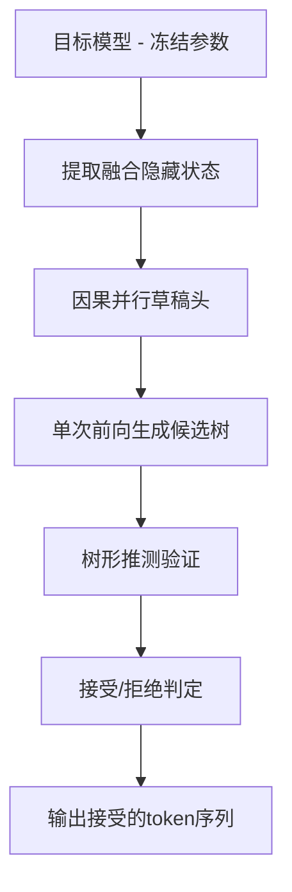

# HuggingFace Daily Papers Top 1 - 2026-06-29

## JetSpec: Breaking the Scaling Ceiling of Speculative Decoding with Parallel Tree Drafting

- **arXiv ID**: 2606.18394
- **作者**: Lanxiang Hu, Zhaoxiang Feng, Yulun Wu, Haoran Yuan, Yujie Zhao, Yu-Yang Qian, Bojun Wang, Peng Zhao, Daxin Jiang, Yibo Zhu, Tajana Rosing, Hao Zhang
- **提交者**: Lanxiang Hu (@Snyhlxde)
- **Upvotes**: 31
- **HuggingFace 链接**: https://huggingface.co/papers/2606.18394
- **arXiv 链接**: https://arxiv.org/abs/2606.18394

---

## 论文解读

### 一、核心贡献与创新点

JetSpec 的核心贡献在于**打破了推测解码（Speculative Decoding）中草稿预算扩展的性能天花板**，提出了一种兼具单次前向推理效率与分支因果条件的草稿生成框架。

主要创新点：

- **揭示因果性-效率困境（Causality-Efficiency Dilemma）**：明确指出现有方法的根本矛盾——自回归草稿器准确但开销随树深增长，双向扩散草稿器高效但生成的候选token互不一致
- **因果并行草稿头（Causal Parallel Draft Head）**：在冻结的目标模型隐藏状态之上训练一个因果并行头，一次前向即可生成整棵候选树，同时保持分支间的因果依赖关系
- **隐藏状态融合机制**：利用目标模型的融合隐藏状态（fused hidden states），使草稿头的评分与目标模型的自回归分解对齐
- **将更大的草稿预算有效转化为更长的接受前缀**，实现端到端加速比的持续提升

### 二、技术方法分析

**关键技术要素：**

1. **单次前向草稿生成**：与自回归草稿器不同，JetSpec 在一次前向传播中并行生成所有候选位置，避免了草稿开销随树深线性增长的问题
2. **分支因果条件（Branch-wise Causal Conditioning）**：不同于双向扩散方法生成的边缘分布候选（branch-agnostic marginals），JetSpec 的候选树中每个节点都条件化于其所在路径的祖先节点，保证树内一致性
3. **与目标模型自回归分解对齐**：草稿头的训练目标确保其输出分布与目标模型的联合分布分解一致，从而提高验证通过率
4. **轻量级 head-based 架构**：作为目标模型之上的附加头，参数量小，训练和部署成本低

### 三、潜在影响与应用场景

**潜在影响：**

- 在 MATH-500 上达到 **9.64x 加速**，对话场景达到 **4.58x 加速**，显著超越现有基线
- 适配 dense 和 MoE 架构（Qwen3），说明方法具有良好的通用性
- 集成 vLLM 后在实际服务负载下仍有显著延迟增益，证明工程可落地性

**应用场景：**

| 场景 | 适用性 |
|------|--------|
| 数学推理（长链推理） | ⭐⭐⭐⭐⭐ |
| 代码生成 | ⭐⭐⭐⭐ |
| 在线对话服务 | ⭐⭐⭐⭐ |
| 边缘部署低延迟推理 | ⭐⭐⭐ |
| 大规模 LLM serving 降本 | ⭐⭐⭐⭐⭐ |

### 四、推荐理由

1. **问题定义精准**：清晰地形式化了现有推测解码方法的根本瓶颈
2. **方法设计优雅**：以极简的方式（单个因果并行头）同时解决效率和准确性问题
3. **实验充分且实用**：覆盖多种任务、多种模型架构，并集成主流推理框架 vLLM
4. **开源可复现**：代码和模型均已开放
5. **加速比显著**：尤其在推理密集型任务上接近 10x 加速，具有极高的实用价值

---

**一句话总结**：JetSpec 通过因果并行草稿头优雅地解决了推测解码中"因果性与效率不可兼得"的核心矛盾，在保持单次前向高效性的同时实现分支一致的候选树生成，将推测解码的加速上限推向新高度。

---

## 摘要 (Abstract)

Speculative decoding (SD) accelerates autoregressive Large Language Models (LLMs) by drafting multiple tokens and verifying them in parallel, but it faces a scaling limitation: increasing the draft budget improves speed only when acceptance remains high and drafting overhead stays low. This ceiling has been difficult to break because prior head-based SD methods face a causality-efficiency dilemma. Autoregressive drafters produce path-conditioned candidates that are effective for tree speculative decoding with higher acceptance length, but their drafting cost grows with tree depth. Bidirectional block-diffusion drafters generate all positions in one pass, but their branch-agnostic marginals can form individually plausible yet mutually inconsistent trees, wasting budget and reducing acceptance. We propose JetSpec, a head-based SD framework that combines one-forward drafting efficiency with branch-wise causal conditioning. JetSpec trains a causal parallel draft head over fused hidden states from the frozen target model, producing candidate trees whose scores align with the target model's autoregressive factorization. This enables JetSpec to convert larger draft budgets into longer accepted prefixes and higher end-to-end speedup. Across math, coding, and chat benchmarks on dense and MoE Qwen3 models, JetSpec consistently outperforms bidirectional-head and tree-based SD baselines. On H100 GPUs, JetSpec achieves up to 9.64x speedup on MATH-500 and 4.58x on open-ended conversational workloads, with further latency gains demonstrated through vLLM integration under realistic serving loads. Our code and models are available at https://github.com/hao-ai-lab/JetSpec.

## AI 摘要

JetSpec is a speculative decoding framework that combines efficient forward drafting with causal conditioning to improve LLM inference speed and acceptance rates across various benchmarks.

## 关键词

speculative decoding, autoregressive Large Language Models, draft budget, acceptance rate, causality-efficiency dilemma, tree speculative decoding, bidirectional block-diffusion, branch-agnostic marginals, causal parallel draft head, fused hidden states, autoregressive factorization, end-to-end speedup, MoE Qwen3, vLLM integration
