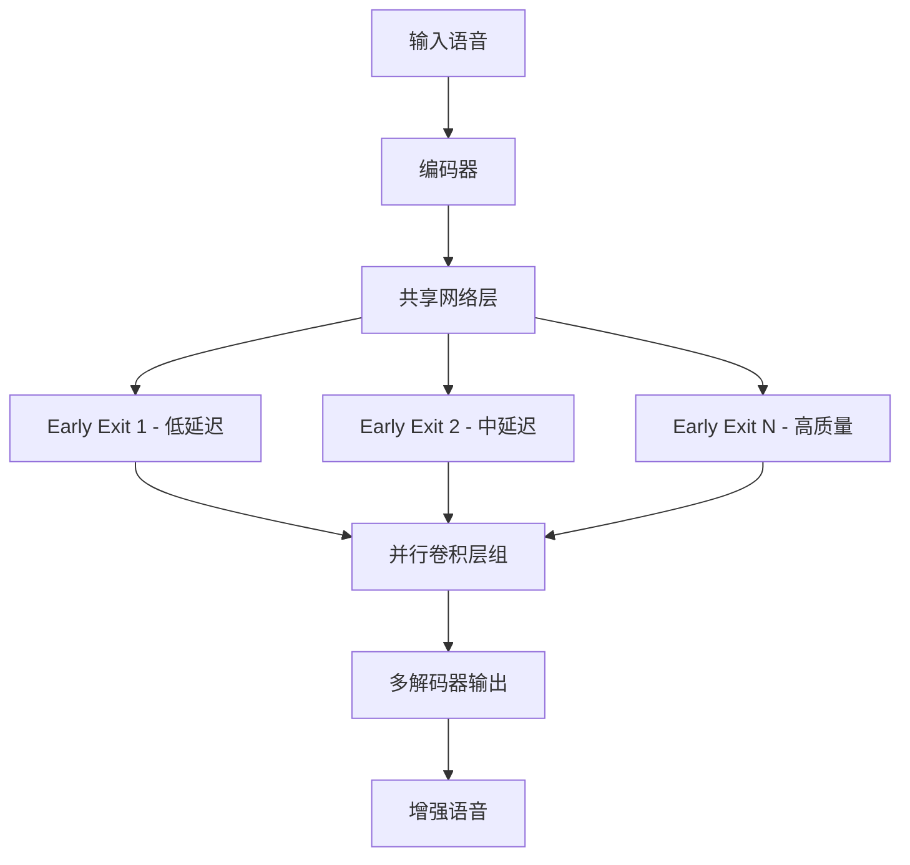

# HuggingFace Daily Papers Top 1 - 2026-07-01

## One Model, Many Latencies: Universal Speech Enhancement for Diverse Real-Time Applications

- **arXiv ID**: 2606.25621
- **作者**: Szu-Wei Fu, Rong Chao, Xuesong Yang, Sung-Feng Huang, Ante Jukić, Yu Tsao, Yu-Chiang Frank Wang
- **提交者**: Szu-Wei (@Weisberger2009)
- **Upvotes**: 16
- **HuggingFace 链接**: https://huggingface.co/papers/2606.25621
- **arXiv 链接**: https://arxiv.org/abs/2606.25621

---

## 论文解读

### 一、核心贡献与创新点

本文提出了 **RE-USE（Real-time Universal Speech Enhancement）** 框架，核心贡献在于：

- **一个模型适配所有延迟需求**：传统方案需要针对不同延迟预算分别训练多个模型，本文实现了单一模型覆盖多种实时场景
- **双维度延迟控制**：
  - **算法延迟（Algorithmic Latency）**：通过可配置的 look-ahead 帧数灵活调节
  - **计算延迟（Computational Latency）**：通过 early-exit 机制在不同网络深度执行推理
- **并行卷积层设计**：解决了不同 padding 配置导致的学习效率低下问题
- **两阶段训练策略**：通过 shared-to-multiple decoder 过渡，缩小通用模型与专用模型之间的性能差距

### 二、技术方法分析

**关键技术要素：**

1. **并行卷积层**：为不同 look-ahead 设置分别配置卷积层，避免了统一 padding 带来的信息泄露或信息不足问题
2. **Early-exit 机制**：允许在网络中间层即可输出结果，计算资源受限时牺牲少量质量换取更低的计算延迟
3. **两阶段训练**：
   - 第一阶段：使用共享 decoder 联合训练所有配置
   - 第二阶段：过渡到多个专用 decoder，精细化各配置下的表现

这种设计将 **延迟-质量权衡** 的选择从训练时推迟到了部署时，赋予了工程师极大的灵活性。

### 三、潜在影响与应用场景

| 应用场景 | 延迟要求 | 本框架优势 |
|---------|---------|-----------|
| 实时通话（VoIP） | ≤ 5ms | 极低 look-ahead + 浅层 exit |
| 视频会议 | 10-20ms | 中等配置，平衡质量 |
| 直播/播客 | 20-40ms | 深层 exit，高质量增强 |
| 助听设备 | ≤ 3ms | 最小延迟配置 |
| 边缘设备部署 | 资源受限 | 单模型多配置，节省存储 |

**潜在影响：**

- **降低部署复杂度**：无需维护多个模型版本，简化 MLOps 流程
- **NVIDIA 生态加持**：模型已发布在 HuggingFace，易于集成到 NVIDIA 音频处理管线
- **推动自适应推理研究**：early-exit 与多延迟控制的结合为其他实时音频任务提供了范式参考

### 四、推荐理由

1. **工程实用性极强**：直接解决了多场景部署中"一模型一延迟"的痛点
2. **设计优雅**：将算法延迟和计算延迟解耦为两个独立可控的维度
3. **开源可复现**：权重已公开在 HuggingFace（`nvidia/Real-time_RE-USE`）
4. **来自 NVIDIA 团队**：工业级质量保证，贴近真实产品需求
5. **方法通用性**：并行卷积 + early-exit 的思路可迁移至降噪、回声消除等相关任务

---

> **一句话总结**：本文通过并行卷积和 early-exit 机制，首次实现了单一语音增强模型在部署时灵活适配不同延迟预算的能力，是实时音频处理领域"一模型通吃"理念的优秀实践。

---

## 摘要 (Abstract)

Different real-time speech applications impose distinct latency budgets, often requiring separately trained enhancement models for each scenario. In this paper, we propose a one-for-all, real-time universal speech enhancement model that provides explicit control over both algorithmic and computational latency. Algorithmic latency is flexibly adjusted via configurable look-ahead frames. To avoid learning inefficiency caused by varying padding configurations, we introduce parallel convolutional layers corresponding to different look-ahead settings. Computational latency is controlled through an early-exit mechanism, enabling inference at different network depths. To narrow the performance gap between specialized and flexible models, we propose a two-stage training strategy with a shared-to-multiple decoder transition. Overall, the proposed framework enables a single model to be deployed across diverse latency budgets without retraining separate models. Model weights are available for download at: https://huggingface.co/nvidia/Real-time_RE-USE

## AI 摘要

A universal speech enhancement model with configurable algorithmic and computational latency controls using parallel convolutions and early-exit mechanisms.

## 关键词

speech enhancement, real-time, latency budget, look-ahead frames, parallel convolutional layers, early-exit mechanism, two-stage training, shared-to-multiple decoder transition
