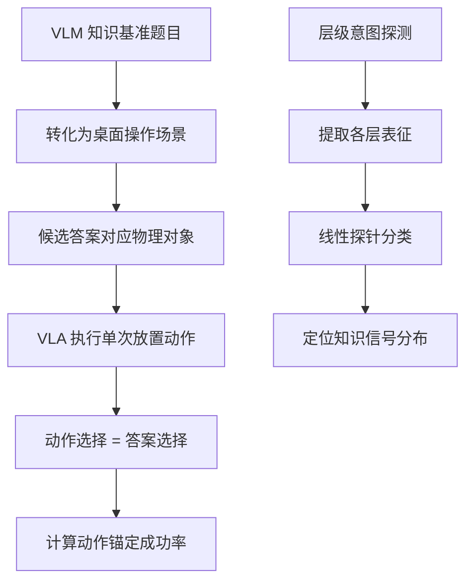

# HuggingFace Daily Papers Top 1 - 2026-07-02

## Does VLA Even Know the Basics? Measuring Commonsense and World Knowledge Retention in Vision-Language-Action Models

- **arXiv ID**: 2606.19297
- **作者**: Nikita Kachaev, Andrey Moskalenko, Matvey Skripkin, Nikita Kurlaev, Daria Pugacheva, Albina Burlova, Mikhail Kolosov, Denis Shepelev, Andrey Kuznetsov, Elena Tutubalina, Aleksandr I. Panov, Alexey K. Kovalev, Vlad Shakhuro
- **提交者**: Nikita (@tttonyalpha)
- **Upvotes**: 41
- **HuggingFace 链接**: https://huggingface.co/papers/2606.19297
- **arXiv 链接**: https://arxiv.org/abs/2606.19297

---

## 论文解读

### 一、核心贡献与创新点

1. **提出 Act2Answer 评估协议**：首创性地将 VLM 知识基准测试转化为 VLA 可执行的动作评估任务，通过让机器人以"放置物体选择答案"的方式回答问题，巧妙地将知识评估与低层控制能力解耦。

2. **揭示 VLA 微调后的知识遗忘现象**：系统性地量化了 VLA 模型在从 VLM 微调为机器人控制模型后，常识知识和世界知识的保留程度，填补了该领域的评估空白。

3. **层级意图探测（Layerwise Intent Probing）**：提出新的分析工具，定位答案相关信息在 VLM 骨干网络和动作头各层中的分布，发现关键信号在中间层达到峰值但在上层衰减。

4. **大规模对比研究**：涵盖 7 个 VLA 模型和 9 个 VLM 基线，提供了迄今最全面的知识保留对比分析。

### 二、技术方法分析

**核心技术要素：**

- **任务转化设计**：将多选题转为物理操作任务，每个选项对应桌面上的一个物体位置，模型通过抓放动作"选择"答案，最大程度减少控制能力不足带来的混淆因素
- **评估维度**：覆盖多种常识和世界知识类别（如物理直觉、因果关系、事实性知识等）
- **探测方法**：在模型各层施加线性探针，追踪答案相关信息的传播路径

**关键发现：**
- VLA 在简单概念上表现尚可，但在语义丰富的类别上与源 VLM 差距较大
- VQA 联合训练有助于知识保留
- 知识信号在中间层最强，上层（靠近动作头）反而减弱

### 三、潜在影响与应用场景

| 维度 | 具体影响 |
|------|----------|
| **模型训练** | 指导 VLA 微调策略，如何在获得控制能力的同时保留知识 |
| **评估标准化** | 为具身智能提供可复现的知识评估基准 |
| **架构设计** | 中间层信号衰减的发现可启发新的网络结构或知识蒸馏方案 |
| **安全部署** | 量化模型知识遗忘程度，评估机器人在开放场景中的可靠性 |
| **训练策略** | 验证了 VQA 联合训练的有效性，为多任务学习提供实证依据 |

### 四、推荐理由

1. **问题定义精准**：抓住了"VLA 到底还记得多少常识"这一被忽视但极其重要的问题
2. **方法设计巧妙**：用动作代替文本回答，既保持了评估的有效性，又避免了控制能力的混淆
3. **实验规模充分**：16 个模型的大规模对比极具参考价值
4. **可操作性强**：发现的规律（如 VQA 联合训练有助于知识保留）可直接指导实践
5. **开源透明**：协议和环境已公开，便于社区复现和扩展

---

**一句话总结：** 本文通过将知识问答转化为物理动作选择，首次系统性揭示了 VLA 模型在微调后的知识遗忘规律，为具身智能模型的训练和评估提供了重要的方法论工具和实证洞察。

---

## 摘要 (Abstract)

Embodied Vision-Language-Action (VLA) models are typically obtained by fine-tuning powerful pretrained VLMs on robotics data, yet it is unclear how much commonsense and factual knowledge they retain after adaptation. Failures on knowledge-sensitive tasks are ambiguous, conflating missing knowledge with poor generalization of low-level control. We introduce Act2Answer, a lightweight protocol that adapts VLM knowledge benchmarks to VLA evaluation by requiring agents to answer through action. Each question becomes a short tabletop episode where the agent performs a single object-placement action to select among candidate answers, yielding an action-grounded success rate with reduced control confounds. We curate a test suite of such environments across diverse commonsense and world-knowledge categories and introduce layerwise intent probing to localize answer-relevant information across the VLM backbone and action head. In a large-scale study of 7 VLA models and 9 VLM baselines, we systematically rank models across categories, finding that VLAs show solid performance on simple concepts while exhibiting larger gaps on richer semantic categories relative to their source VLMs, that VQA co-training is associated with better knowledge retention, and that answer-relevant signals peak in middle VLA layers but attenuate in upper layers. Act2Answer is available at https://tttonyalpha.github.io/act2answer/.

## AI 摘要

Act2Answer protocol evaluates embodied vision-language-action models by having agents answer questions through physical actions, revealing knowledge retention and generalization patterns across different semantic categories.

## 关键词

Vision-Language-Action models, pretrained VLMs, robotics data, knowledge-sensitive tasks, action-grounded success rate, commonsense knowledge, world-knowledge categories, layerwise intent probing, VQA co-training, semantic categories
