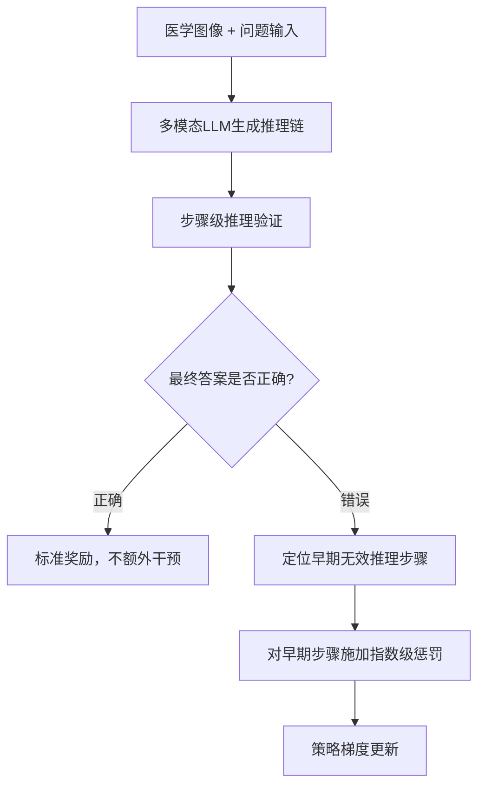

# HuggingFace Daily Papers Top 1 - 2026-07-04

## Breaking Failure Cascades: Step-Aware Reinforcement Learning for Medical Multimodal Reasoning

- **arXiv ID**: 2606.31825
- **作者**: Junha Jung, Minbyul Jeong, Suhyeon Lim, Sungwook Jung, Jaehoon Yun, Taeyun Roh, Mujeen Sung, Jaewoo Kang
- **提交者**: Minbyul Jeong (@Minbyul)
- **Upvotes**: 14
- **HuggingFace 链接**: https://huggingface.co/papers/2606.31825
- **arXiv 链接**: https://arxiv.org/abs/2606.31825

---

## 论文解读

### 一、核心贡献与创新点

1. **发现级联错误问题**：论文揭示了医学视觉问答中，早期推理步骤的错误会像多米诺骨牌一样级联传播，导致最终答案错误。这一发现为改进医学多模态推理提供了明确的优化方向。

2. **提出 MRPO 算法**：设计了 Medical Reasoning-aware Policy Optimization（MRPO），一种融合逐步过程奖励（step-wise process rewards）的强化学习算法，突破了传统"仅关注最终结果"的训练范式。

3. **指数级早期惩罚机制**：当最终答案错误时，对早期无效推理步骤中的 token 施加指数递增的惩罚，精准打断失败级联链，同时不影响正确的推理路径。

4. **显著效果**：将早期推理失败率从 **64.0% 降至 13.0%**，在 Qwen3-VL-8B 上甚至超越 34B 规模的医学专用模型（HuatuoGPT-Vision-34B）2.79 个点。

### 二、技术方法分析

**核心技术要点：**

- **信用分配问题的解决**：传统 outcome-centric 方法（如标准 GRPO）仅基于最终答案正确与否给出稀疏奖励，难以定位推理链中具体哪一步出错。MRPO 通过细粒度的 step-level 奖励解决了这一问题。

- **惩罚权重设计**：对错误推理链中越早期的无效步骤施加越大的惩罚（指数衰减），符合"源头错误危害最大"的直觉——越早出错，后续所有步骤都受影响。

- **与 GRPO 的关系**：MRPO 建立在 GRPO 框架之上，额外引入过程监督信号，是对现有 RL 后训练流程的增量改进，具备良好的兼容性。

- **跨骨干网络验证**：在三种不同的多模态 LLM 骨干网络上均验证了有效性，证明方法的通用性。

### 三、潜在影响与应用场景

| 维度 | 分析 |
|------|------|
| **临床辅助诊断** | 医学推理要求每一步都可靠，MRPO 提升了推理链的可信度，有助于辅助影像诊断 |
| **可解释性** | 步骤级优化天然提升了推理过程的透明度，符合医疗 AI 的可解释性需求 |
| **方法迁移性** | 指数级早期惩罚的思路可迁移到法律推理、科学推导等需要严格逻辑链的场景 |
| **效率优势** | 8B 模型超越 34B 模型，意味着更低的部署成本，利于实际落地 |
| **RL for Reasoning 范式** | 为多模态推理的过程监督提供了新的技术路线 |

**潜在局限**：过程奖励模型（PRM）本身的准确性可能成为瓶颈；医学领域推理步骤的有效性判断需要领域专家验证。

### 四、推荐理由

1. **问题抓得准**：级联错误是 CoT 推理的核心痛点，论文用数据量化了这一现象（64%→13%），说服力强。
2. **方法设计优雅**：指数惩罚机制简洁有效，易于复现和集成到现有训练流程。
3. **实验充分**：多骨干、多基线对比，且小模型超大模型的结果极具实用价值。
4. **开源代码**：代码已公开，有利于社区复现和后续研究。
5. **医疗场景刚需**：推理质量对医疗决策至关重要，该工作直接回应了临床安全性需求。

---

**一句话总结**：MRPO 通过对推理链早期错误施加指数级惩罚来打断级联失败，以精巧的过程监督信号显著提升了医学多模态推理的可靠性，是将 RL 过程奖励应用于临床 AI 的代表性工作。

---

## 摘要 (Abstract)

Recent multimodal large language models have shown great promise in clinical image reasoning, but existing post-training pipelines remain predominantly outcome-centric, relying on final answer correctness or sequence-level preferences. This suffers from sparse credit assignment, making it difficult to optimize the reasoning process essential for clinical applications. Our analysis reveals that cascading errors from early-stage reasoning failures are a leading cause of incorrect predictions in medical visual question answering (VQA) benchmarks. Motivated by this, we propose Medical Reasoning-aware Policy Optimization (MRPO), an RL algorithm that incorporates step-wise process rewards. When the final answer is incorrect, MRPO assigns exponentially larger penalties to tokens in earlier invalid reasoning steps, breaking failure cascades without compromising successful paths. Across three multimodal LLM backbones, MRPO consistently outperforms standard GRPO and a recent RL baseline, and on Qwen3-VL-8B-Instruct even surpasses substantially larger medical MLLMs such as HuatuoGPT-Vision-34B by 2.79 points. Moreover, MRPO reduces early-stage reasoning failures from 64.0% to 13.0%, showing that targeted mitigation of cascading failures improves both reasoning quality and final answer accuracy. Our code is available at https://github.com/dmis-lab/MRPO

## AI 摘要

A reinforcement learning approach called MRPO is introduced to improve clinical image reasoning by addressing cascading errors through step-wise process rewards, demonstrating superior performance over existing methods.

## 关键词

multimodal large language models, medical visual question answering, reinforcement learning, policy optimization, cascading errors, step-wise process rewards, reasoning process, final answer correctness, credit assignment
