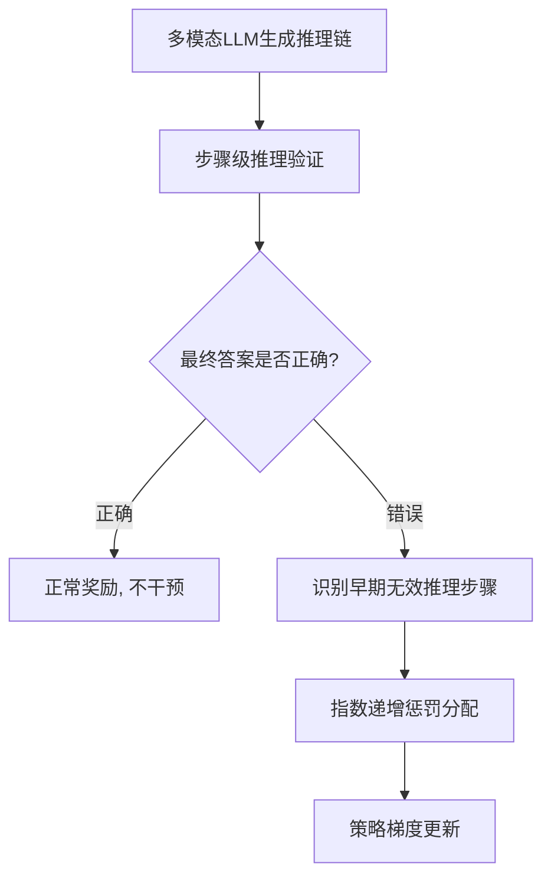

# HuggingFace Daily Papers Top 1 - 2026-07-05

## Breaking Failure Cascades: Step-Aware Reinforcement Learning for Medical Multimodal Reasoning

- **arXiv ID**: 2606.31825
- **作者**: Junha Jung, Minbyul Jeong, Suhyeon Lim, Sungwook Jung, Jaehoon Yun, Taeyun Roh, Mujeen Sung, Jaewoo Kang
- **提交者**: Minbyul Jeong (@Minbyul)
- **Upvotes**: 17
- **HuggingFace 链接**: https://huggingface.co/papers/2606.31825
- **arXiv 链接**: https://arxiv.org/abs/2606.31825

---

## 论文解读

### 一、核心贡献与创新点

1. **发现级联错误问题**：论文通过分析揭示，医学视觉问答中错误预测的主要原因是早期推理步骤的失败引发的"级联错误"（failure cascades），即早期一步错导致后续步步错。

2. **提出 MRPO 算法**：设计了 Medical Reasoning-aware Policy Optimization（MRPO），一种融合逐步过程奖励（step-wise process rewards）的强化学习算法，突破了传统仅依赖最终答案正确性的稀疏信用分配问题。

3. **指数惩罚机制**：当最终答案错误时，对早期无效推理步骤中的 token 施加指数级递增的惩罚，精准打断错误级联链条，同时不影响成功的推理路径。

4. **显著效果验证**：在 Qwen3-VL-8B-Instruct 上甚至超越了 HuatuoGPT-Vision-34B（大 4 倍以上的模型）2.79 分，早期推理失败率从 64.0% 降至 13.0%。

### 二、技术方法分析

**核心技术要素：**

- **基础框架**：基于 GRPO（Group Relative Policy Optimization）进行改进
- **过程奖励模型**：引入 step-wise 的过程奖励信号，对推理链中每一步进行评估
- **惩罚分配策略**：对错误答案的推理链，越早出现的无效步骤获得越大的惩罚权重（指数衰减），体现了"源头治理"的思想
- **信用分配优化**：解决了传统 outcome-centric 方法中稀疏奖励导致的信用分配困难
- **兼容性**：在三种不同的多模态 LLM backbone 上均有效，展示了方法的通用性

### 三、潜在影响与应用场景

| 维度 | 分析 |
|------|------|
| **临床决策支持** | 提升医学影像推理的可靠性，减少因推理链错误导致的误诊 |
| **可解释性** | 逐步推理优化使模型决策过程更透明，符合医学 AI 的可审计要求 |
| **小模型高效化** | 8B 模型超越 34B 模型，为资源受限的医疗场景部署提供可能 |
| **方法迁移性** | 级联错误惩罚机制可推广至法律推理、科学问答等需要严谨多步推理的领域 |
| **RL 训练范式** | 为多模态 LLM 的后训练提供了更精细的过程监督思路 |

**潜在局限**：过程奖励模型本身的准确性可能成为瓶颈；指数惩罚的超参数选择需要领域知识。

### 四、推荐理由

1. **问题抓得准**：级联错误是多步推理模型的核心痛点，论文从现象分析到方法设计逻辑清晰
2. **方法简洁有效**：无需复杂架构改动，仅在奖励分配层面创新，易于复现和集成
3. **实验说服力强**：小模型超大模型的结果极具实用价值，早期失败率从 64%→13% 的改善幅度惊人
4. **开源可复现**：代码已公开，利于社区验证和跟进
5. **临床适用性高**：医学场景对推理过程正确性要求极高，该方法直击核心需求

---

**一句话总结**：MRPO 通过对早期推理错误施加指数级惩罚来打断级联失败链条，以精细的过程监督取代粗粒度的结果监督，为医学多模态推理提供了一种高效且可靠的强化学习训练范式。

---

## 摘要 (Abstract)

Recent multimodal large language models have shown great promise in clinical image reasoning, but existing post-training pipelines remain predominantly outcome-centric, relying on final answer correctness or sequence-level preferences. This suffers from sparse credit assignment, making it difficult to optimize the reasoning process essential for clinical applications. Our analysis reveals that cascading errors from early-stage reasoning failures are a leading cause of incorrect predictions in medical visual question answering (VQA) benchmarks. Motivated by this, we propose Medical Reasoning-aware Policy Optimization (MRPO), an RL algorithm that incorporates step-wise process rewards. When the final answer is incorrect, MRPO assigns exponentially larger penalties to tokens in earlier invalid reasoning steps, breaking failure cascades without compromising successful paths. Across three multimodal LLM backbones, MRPO consistently outperforms standard GRPO and a recent RL baseline, and on Qwen3-VL-8B-Instruct even surpasses substantially larger medical MLLMs such as HuatuoGPT-Vision-34B by 2.79 points. Moreover, MRPO reduces early-stage reasoning failures from 64.0% to 13.0%, showing that targeted mitigation of cascading failures improves both reasoning quality and final answer accuracy. Our code is available at https://github.com/dmis-lab/MRPO

## AI 摘要

A reinforcement learning approach called MRPO is introduced to improve clinical image reasoning by addressing cascading errors through step-wise process rewards, demonstrating superior performance over existing methods.

## 关键词

multimodal large language models, medical visual question answering, reinforcement learning, policy optimization, cascading errors, step-wise process rewards, reasoning process, final answer correctness, credit assignment
