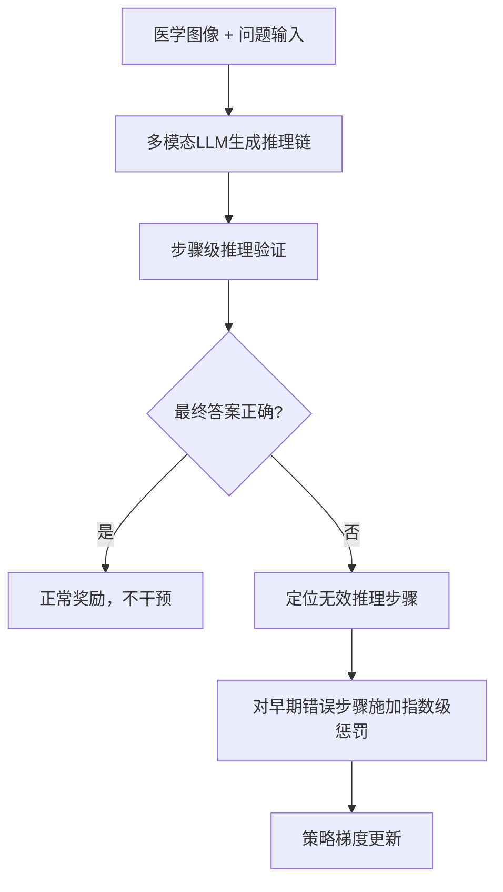

# HuggingFace Daily Papers Top 1 - 2026-07-06

## Breaking Failure Cascades: Step-Aware Reinforcement Learning for Medical Multimodal Reasoning

- **arXiv ID**: 2606.31825
- **作者**: Junha Jung, Minbyul Jeong, Suhyeon Lim, Sungwook Jung, Jaehoon Yun, Taeyun Roh, Mujeen Sung, Jaewoo Kang
- **提交者**: Minbyul Jeong (@Minbyul)
- **Upvotes**: 19
- **HuggingFace 链接**: https://huggingface.co/papers/2606.31825
- **arXiv 链接**: https://arxiv.org/abs/2606.31825

---

## 论文解读

### 一、核心贡献与创新点

1. **发现关键问题**：揭示了医学视觉问答中"级联错误"（cascading errors）现象——早期推理步骤的失败会像多米诺骨牌一样导致后续推理全面崩溃，这是模型预测错误的主要原因。

2. **提出 MRPO 算法**：设计了 Medical Reasoning-aware Policy Optimization，一种融合**步级过程奖励**（step-wise process rewards）的强化学习算法，突破了传统仅依赖最终答案正确性的"结果导向"训练范式。

3. **指数级惩罚机制**：当最终答案错误时，对早期无效推理步骤中的 token 施加**指数递增的惩罚**，精准打断失败级联链，同时不损害成功的推理路径。

4. **显著效果**：将早期推理失败率从 64.0% 降至 13.0%；基于 Qwen3-VL-8B 的模型甚至超越了 HuatuoGPT-Vision-34B 等大4倍以上的专用医学模型。

### 二、技术方法分析

**核心技术要素**：

- **稀疏信用分配问题的解决**：传统 GRPO 仅在序列级别给出奖励/惩罚信号，MRPO 将信号分解到每个推理步骤，实现细粒度优化。

- **指数衰减惩罚设计**：越早出现的错误步骤获得越大的惩罚权重（指数递增），符合"早期错误危害更大"的直觉——因为早期错误会污染所有后续推理。

- **选择性干预策略**：仅在最终答案错误时启动步级惩罚，正确推理路径不受影响，避免了过度惩罚导致的训练不稳定。

- **骨干模型无关性**：在三种不同的多模态 LLM 上验证了一致性提升，说明方法具有良好的通用性。

### 三、潜在影响与应用场景

| 维度 | 分析 |
|------|------|
| **临床辅助诊断** | 提升医学影像分析的推理可靠性，减少因中间逻辑错误导致的误诊 |
| **可解释性** | 步级推理优化使模型的决策过程更透明，更符合医学场景对可解释性的要求 |
| **小模型替代大模型** | 8B 模型超越 34B 专用模型，为资源受限的医疗机构部署提供可能 |
| **方法迁移** | 级联错误打断思路可推广到法律推理、数学证明等其他需要严格逻辑链的场景 |
| **RL for reasoning 范式推进** | 为 process reward model 在多模态场景的应用提供了新的设计思路 |

**潜在局限**：步骤级验证器的构建质量直接影响方法效果；医学领域的推理步骤标注可能需要专业知识。

### 四、推荐理由

1. **问题切入精准**：级联错误是一个被广泛忽视但影响巨大的问题，论文用数据（64%→13%）证明了其重要性和可解决性。
2. **方法设计优雅**：指数惩罚+选择性干预的组合简洁有效，工程实现友好。
3. **实验说服力强**：跨三种骨干模型的一致提升、小模型胜大模型的结果令人印象深刻。
4. **应用价值高**：直接服务于高风险的医疗AI场景，具有明确的社会价值。

---

**一句话总结**：MRPO 通过对早期推理错误施加指数级惩罚来打断医学多模态推理中的失败级联，以精巧的步级强化学习设计实现了"小模型胜大模型"的效果，为可靠的临床AI推理开辟了新路径。

---

## 摘要 (Abstract)

Recent multimodal large language models have shown great promise in clinical image reasoning, but existing post-training pipelines remain predominantly outcome-centric, relying on final answer correctness or sequence-level preferences. This suffers from sparse credit assignment, making it difficult to optimize the reasoning process essential for clinical applications. Our analysis reveals that cascading errors from early-stage reasoning failures are a leading cause of incorrect predictions in medical visual question answering (VQA) benchmarks. Motivated by this, we propose Medical Reasoning-aware Policy Optimization (MRPO), an RL algorithm that incorporates step-wise process rewards. When the final answer is incorrect, MRPO assigns exponentially larger penalties to tokens in earlier invalid reasoning steps, breaking failure cascades without compromising successful paths. Across three multimodal LLM backbones, MRPO consistently outperforms standard GRPO and a recent RL baseline, and on Qwen3-VL-8B-Instruct even surpasses substantially larger medical MLLMs such as HuatuoGPT-Vision-34B by 2.79 points. Moreover, MRPO reduces early-stage reasoning failures from 64.0% to 13.0%, showing that targeted mitigation of cascading failures improves both reasoning quality and final answer accuracy. Our code is available at https://github.com/dmis-lab/MRPO

## AI 摘要

A reinforcement learning approach called MRPO is introduced to improve clinical image reasoning by addressing cascading errors through step-wise process rewards, demonstrating superior performance over existing methods.

## 关键词

multimodal large language models, medical visual question answering, reinforcement learning, policy optimization, cascading errors, step-wise process rewards, reasoning process, final answer correctness, credit assignment
