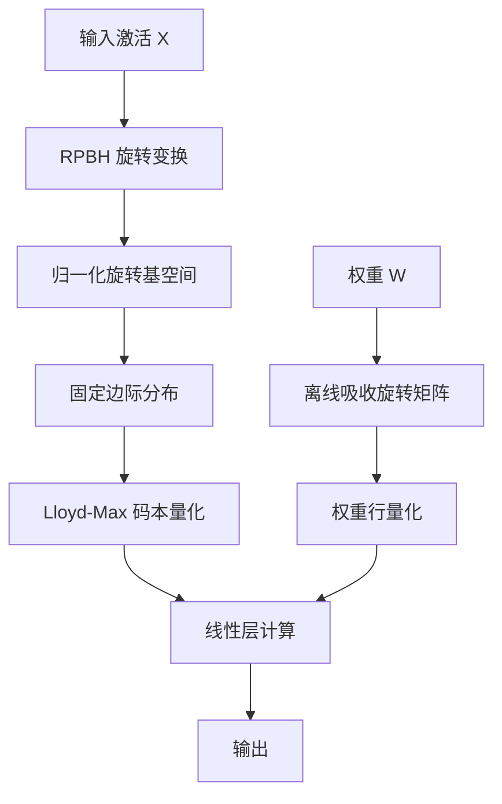

# HuggingFace Daily Papers Top 1 - 2026-07-07

## OrbitQuant: Data-Agnostic Quantization for Image and Video Diffusion Transformers

- **arXiv ID**: 2607.02461
- **作者**: Donghyun Lee, Jitesh Chavan, Duy Nguyen, Sam Huang, Liming Jiang, Priyadarshini Panda, Timo Mertens, Saurabh Shukla
- **提交者**: Saurabh Shukla (@saurabhcantina)
- **Upvotes**: 27
- **HuggingFace 链接**: https://huggingface.co/papers/2607.02461
- **arXiv 链接**: https://arxiv.org/abs/2607.02461

---

## 论文解读

### 一、核心贡献与创新点

OrbitQuant 提出了一种**数据无关（data-agnostic）**的权重-激活量化方案，专门针对扩散 Transformer（DiT）模型，核心创新包括：

- **消除校准数据依赖**：传统 PTQ 方法需要针对每个新模型/模态重新收集校准数据来估计激活范围，OrbitQuant 通过在归一化旋转基下量化，彻底绕过了范围估计步骤
- **统一码本跨时间步/提示/层复用**：利用随机置换分块 Hadamard（RPBH）旋转，使每个坐标收敛到一个固定已知的边际分布，从而一个 Lloyd-Max 码本即可服务所有场景
- **跨模态零调优迁移**：同一量化方案无需任何逐模态调参即可从图像生成迁移到视频生成
- **极低比特突破**：首次将图像扩散 Transformer 的 PTQ 推进到 **W2A4**（权重2位、激活4位）并保持可用的生成质量

### 二、技术方法分析

**关键技术要素：**

1. **随机置换分块 Hadamard（RPBH）旋转**：
   - 对激活施加正交旋转变换，将不同分布的激活映射到统一的、可预测的边际分布
   - 分块结构保证计算高效（$O(n \log n)$ 复杂度）

2. **归一化旋转基量化**：
   - 在变换后的空间中，各坐标近似服从同一分布
   - 预计算的 Lloyd-Max 最优码本可直接使用，无需运行时标定

3. **旋转吸收机制**：
   - 将旋转矩阵 $R$ 吸收进权重：$W' = WR^T$，离线完成
   - 运行时只需对激活做前向旋转：$y = W'(Rx) = WR^TRx = Wx$
   - 旋转在线性层内部相消，不引入额外误差

4. **实验验证**：在 FLUX.1、Z-Image-Turbo、Wan 2.1、CogVideoX 等多个模型上达到 SOTA

### 三、潜在影响与应用场景

| 维度 | 影响 |
|------|------|
| **部署效率** | W2A4 使大型 DiT 模型可部署在边缘设备/消费级 GPU 上 |
| **工程成本** | 数据无关特性大幅降低量化部署的工程门槛，无需为每个模型收集校准集 |
| **通用性** | 同一方案覆盖图像/视频，未来可能扩展到音频、3D 等更多模态 |
| **实时推理** | 配合多步采样的显存/带宽节省，有望实现实时视频生成 |
| **产业落地** | 适用于云端批量推理降本、移动端 AI 创作工具、视频编辑流水线 |

**潜在局限**：W2A4 极低比特下的质量退化仍需关注；RPBH 旋转的额外计算开销在小 batch 场景下占比可能不可忽略。

### 四、推荐理由

- **实用价值极高**：直接解决了 DiT 量化中"换模型就要重新校准"的核心痛点
- **理论优雅**：利用随机矩阵理论将分布不确定性问题转化为固定分布问题，思路巧妙
- **实验全面**：覆盖主流图像和视频 DiT 模型，多个比特设置下均为 SOTA
- **工业友好**：数据无关 + 跨模态迁移 = 极低部署门槛，具备大规模落地条件

---

**一句话总结**：OrbitQuant 通过旋转归一化将扩散 Transformer 的量化从"逐模型标定"升级为"一次设计、处处适用"，在极低比特下实现了质量与效率的最佳平衡。

---

## 摘要 (Abstract)

Diffusion transformers (DiTs) achieve state-of-the-art image and video generation, but their multi-step sampling and growing parameter count make inference expensive. Post-training quantization (PTQ) is the natural remedy, yet DiT activations shift across timesteps, prompts, and guidance branches, forcing prior methods to re-fit calibration data for every new checkpoint or modality. We present OrbitQuant, a data-agnostic weight-activation quantizer that bypasses range estimation by quantizing in a normalized, rotated basis. In this basis, a randomized permuted block-Hadamard (RPBH) rotation concentrates each coordinate around one fixed, known marginal regardless of the input, so a single Lloyd-Max codebook serves all timesteps, prompts, and layers of a given input dimension. We extend the same quantizer to weight rows offline, absorbing the rotation into the weights so that it cancels inside each linear layer and only a forward rotation on the activations remains at runtime. The same recipe transfers from image to video with no per-modality tuning. Across FLUX.1, Z-Image-Turbo, Wan 2.1, and CogVideoX, it sets the state of the art for PTQ at several low-bit settings. It also pushes PTQ of image diffusion transformers to W2A4 with usable generation quality.

## AI 摘要

OrbitQuant enables efficient post-training quantization for diffusion transformers by using a normalized rotated basis that eliminates the need for recalibration across different timesteps and modalities.

## 关键词

diffusion transformers, post-training quantization, weight-activation quantizer, normalized rotated basis, randomized permuted block-Hadamard, Lloyd-Max codebook, quantization, diffusion models, image generation, video generation
