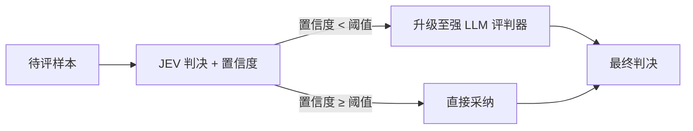

# HuggingFace Daily Papers Top 1 - 2026-09-24

## JEV-as-a-Judge: Accept When Confident, Escalate When Unsure

- **arXiv ID**: 2609.26550
- **作者**: Yubo Li, Yidi Miao, Ramayya Krishnan, Rema Padman
- **提交者**: yubol-bobo (@yubol)
- **Upvotes**: 17
- **HuggingFace 链接**: https://huggingface.co/papers/2609.26550
- **arXiv 链接**: https://arxiv.org/abs/2609.26550

---

## 论文解读

### 一、核心贡献与创新点

- **提出“仅决策型”评判器作为低成本初筛**：研究 JEV-as-a-Judge 这类只输出判决结果（而非生成长篇理由）的评判器，能否在大规模评估中承担经济的第一道筛选。
- **系统性对比评测**：与 **16 种**生成式评判器和奖励模型评判器进行比较，并引入**盲审人工裁决**作为参考标准，提高结论可信度。
- **成本与精度的量化结论**：在常规偏好判断和基于证据的事实性判断任务上，JEV 与最强对照（某 SOTA LLM 评判器）的差距在 **3 个百分点以内**，费用仅为其 **0.36%**。
- **揭示误差集中规律**：在多个基准上，JEV 与对照模型的差距**主要集中在低置信度决策**中，说明其置信度具有可用的区分能力。
- **冻结级联方案**：高置信度结果直接采纳，低置信度样本升级给强评判器，在更低成本下保留对照模型 **99%** 的准确率。

> 注：摘要未说明 “JEV” 的全称与具体架构，以下分析基于摘要可推断的内容。

### 二、技术方法分析

| 维度 | 分析 |
|---|---|
| **评判范式** | 仅输出判决（如偏好选择、真/假），不生成推理链，推理成本显著降低 |
| **置信度利用** | 以判决置信度作为路由信号，关键前提是置信度需较好地校准 |
| **级联策略** | “冻结”意味着阈值与组件在评估前固定，避免在测试集上调参导致结果偏乐观 |
| **评估设计** | 覆盖偏好、事实性、推导验证、对抗性错误答案等多类任务，并使用盲审人工标注 |

**成本–精度权衡**可粗略表示为：

$$
\text{Cost} = C_{\text{JEV}} + r \cdot C_{\text{strong}}, \qquad
\text{Acc} \approx (1-r)\,\text{Acc}_{\text{JEV}\mid\text{conf}} + r\,\text{Acc}_{\text{strong}\mid\text{unsure}}
$$

其中 $r$ 为升级比例。由于 $C_{\text{JEV}} \ll C_{\text{strong}}$，总成本主要由 $r$ 决定。

**已识别的局限**：
- 需要**核查推导过程**的任务（如数学、逻辑）差距较大；
- 面对**措辞精致但错误的答案**时鲁棒性不足，说明仅决策型评判器容易被表面质量误导。

### 三、潜在影响与应用场景

- **大规模模型评估**：基准测试、模型迭代回归评估中可大幅降低评判费用。
- **RLHF / 偏好数据构建**：低成本筛选偏好对，仅将疑难样本交给强模型或人工标注。
- **生产环境质量监控**：对线上输出做实时事实性检查，将不确定样本送入人工审核。
- **启示意义**：表明评判任务并非都需要强生成式模型，“按难度分配算力”是可行的评估设计原则；同时提醒在推理密集和对抗性场景中不能盲目依赖廉价评判器。

### 四、推荐理由

1. **问题务实**：直击 LLM-as-a-judge 在规模化应用时的成本与可靠性痛点。
2. **结论清晰可操作**：“自信时采纳、不确定时升级”策略简单，易于落地。
3. **实验较扎实**：16 种对照模型加盲审人工裁决，并如实报告了失效场景。
4. **经济性突出**：以 0.36% 的费用接近 SOTA 表现，级联后保留 99% 准确率，性价比显著。

**一句话总结**：该论文表明，廉价的仅决策型评判器配合置信度驱动的升级级联，能以极低成本逼近顶级 LLM 评判器的准确率，为规模化自动评估提供了实用的降本方案。

---

## 摘要 (Abstract)

LLM-as-a-judge enables evaluation across diverse tasks, but inference cost and confidence reliability become critical at scale. We study whether a decision-only judge can provide an economical first pass and identify when stronger evaluation is needed. Comparing jev-as-a-judge with sixteen generative and reward-model judges, with blinded human adjudication, we find it within three percentage points of a state-of-the-art LLM judge, our strongest comparator, on ordinary preference and evidence-grounded factuality at 0.36% of the comparator's fee. Larger gaps arise when judgments require checking a derivation or resisting an elaborately written wrong answer. On several benchmarks, JEV's gap to this comparator is concentrated in low-confidence decisions. A frozen cascade that accepts confident verdicts and escalates uncertain ones retains 99% of the comparator's accuracy at lower cost.

## AI 摘要

无

## 关键词

无
